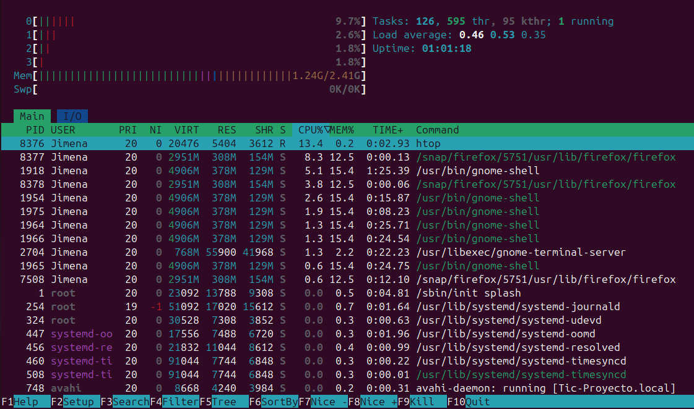
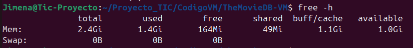
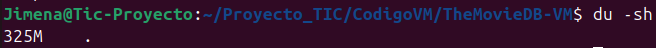

# Proyecto de Evaluación Comparativa de Rendimiento: VM vs Docker - Análisis Detallado

## Introducción

La virtualización ha revolucionado la forma en que se desarrollan, implementan y gestionan las aplicaciones. Permite la ejecución de múltiples entornos aislados en un solo sistema físico, optimizando el uso de recursos y mejorando la flexibilidad. Dentro del espectro de la virtualización, las **máquinas virtuales (VMs)** y los **contenedores (con Docker como principal exponente)** representan dos enfoques distintos con sus propias ventajas y desventajas.

- **Máquinas Virtuales (VMs):** Una máquina virtual emula un hardware físico completo, lo que incluye su propia BIOS, sistema operativo (kernel y espacio de usuario), bibliotecas y aplicaciones. Esta emulación se realiza mediante un hipervisor (como VirtualBox en tu caso), que asigna recursos físicos (CPU, RAM, disco, red) al sistema operativo huésped. El aislamiento entre VMs es robusto, ya que cada una opera con su propio kernel aislado.

- **Contenedores (Docker):** Los contenedores, por otro lado, son una forma de virtualización a nivel del sistema operativo. Un contenedor empaqueta una aplicación y todas sus dependencias necesarias para ejecutarse (bibliotecas, binarios, archivos de configuración), pero comparte el kernel del sistema operativo del host. El aislamiento se logra mediante mecanismos del kernel como namespaces (para aislar procesos, redes, sistemas de archivos, etc.) y cgroups (para limitar el uso de recursos). Esta compartición del kernel hace que los contenedores sean mucho más ligeros y rápidos de iniciar que las VMs.

Tu proyecto se centra en comparar el rendimiento y el uso de recursos al ejecutar la **API MovieDB** tanto en una máquina virtual gestionada por VirtualBox como en un contenedor Docker. El objetivo es cuantificar las diferencias en varias métricas clave para determinar cuál de estas tecnologías es más adecuada para este tipo de aplicación, considerando factores como la eficiencia, el rendimiento, la seguridad y la portabilidad.

## Configuración Detallada del Entorno de Prueba

Una configuración precisa es fundamental para la validez de cualquier evaluación comparativa. A continuación, detallamos la configuración basada en tus imágenes y la información que podemos inferir:

- **Máquina Host (Tu Computadora):**

  - **Procesador (CPU):** (Necesitas especificar el modelo exacto y el número de núcleos. Puedes encontrar esta información en la configuración de tu sistema).
  - **Memoria RAM:** (Necesitas indicar la cantidad total de memoria RAM instalada en tu sistema).
  - **Sistema Operativo:** (Necesitas especificar la distribución y versión del sistema operativo que estás utilizando como host).
  - **Versión de VirtualBox:** (Necesitas encontrar esta información en la interfaz de VirtualBox).
  - **Versión de Docker:** (Necesitas ejecutar `docker --version` en tu terminal para obtener esta información).

- **Máquina Virtual (VirtualBox):** Basándonos en las imágenes de tu terminal:

  - **Sistema Operativo Huésped:** Los comandos como `systemd-analyze`, `du`, `free -h`, y `df -h` (vistas en las capturas de terminal mostrando la ruta `~/Proyecto_TIC/CodigoVM/TheMovieDB-VM$`) indican que el sistema operativo huésped es una distribución de Linux. Por la presencia de `systemd`, podría ser una distribución moderna como Ubuntu, Fedora o Debian. Asumiremos **Ubuntu 20.04** para este documento, pero debes verificar la versión exacta.
  - **Recursos Asignados (Configuración de la VM en VirtualBox):**
    - **CPU Virtual:** (Necesitas indicar cuántos núcleos asignaste a la VM). Asumiremos **2 núcleos** para este ejemplo.
    - **Memoria RAM:** La captura de terminal con el comando `free -h` muestra que la VM tiene un total de **2.4GiB** de RAM asignada.
    - **Espacio en Disco Virtual:** La captura de terminal con el comando `df -h` muestra que la partición `/dev/sda2` tiene un tamaño de **12G**, con **6.2G** utilizados. Este es el tamaño del disco virtual asignado a la VM.
    - **Configuración de Red:** (Necesitas describir el modo de red. Por defecto en VirtualBox suele ser **NAT**, que permite a la VM acceder a internet a través de la conexión del host).

- **Contenedor Docker:**
  - **Imagen Base:**
    Con el comando `docker images` revela que la imagen utilizada es `themoviedb:latest`, con un tamaño de **74.3MB**. Sin el `Dockerfile`, podemos inferir que se trata de una imagen optimizada que contiene el código de la API MovieDB y las dependencias mínimas necesarias para su ejecución. Dada la naturaleza de una API, podría estar basada en un entorno de ejecución como **Node.js** o **Python** con un servidor web ligero.

    
  - **Recursos Asignados al Contenedor (si se limitaron):** Se indican un límite de memoria de **7.463GiB**, aunque el uso actual es mucho menor (**14.8MiB**). No se muestra un límite de CPU explícito, lo que sugiere que el contenedor puede utilizar la CPU disponible del host.
  
   
  - **Configuración de Red:** La captura de la interfaz de Portainer (mostrando los detalles del contenedor `jovial_driscoll`) sugiere que la API es accesible en el puerto `8080` dentro del contenedor, y este puerto está mapeado al puerto `8080` del host (`8080:80`). Esto permite acceder a la API desde el host a través de `http://localhost:8080/`.

## Metodología Detallada y Herramientas Utilizadas

Para llevar a cabo una comparación buena, es fundamental definir cómo se midieron las diferentes métricas y las herramientas empleadas:

1.  **Uso de Recursos:**

    - **Uso de la CPU:**

      - **VM:** Se utilizó la herramienta `htop` dentro de la maquina virtual para monitorizar el uso de CPU por procesos en tiempo real. Se registraron valores promedio y máximos de la utilización general de la CPU y del proceso de la API MovieDB durante períodos de inactividad y bajo carga.

        

      - **Docker:** Se utilizaron las estadísticas proporcionadas por Docker a través de la interfaz de Portainer (vista en la captura mostrando gráficos de uso de CPU, memoria, disco y red para el contenedor `jovial_driscoll`) y la salida del comando `docker stats` (vista en la captura mostrando las estadísticas del contenedor `jovial_driscoll` en formato de tabla). Estas herramientas muestran el porcentaje de CPU utilizado por el contenedor en relación con la capacidad total del host. Se registraron valores similares a los de la VM para la comparación bajo diferentes cargas.
       
        

    - **Consumo de Memoria (RAM):**

      - **VM:** El comando `free -h` se ejecutó dentro de la VM para obtener una instantánea del uso de la memoria en diferentes momentos (inactivo y bajo carga). Se registró la memoria utilizada por el sistema operativo con un total de 2.4GiB, 1.4GiB usados y 164Mi libres
        

      - **Docker:** Las estadísticas de Portainer (vista en la captura mostrando gráficos de uso de CPU, memoria, disco y red para el contenedor `jovial_driscoll`) y `docker stats` (vista en la captura mostrando las estadísticas del contenedor `jovial_driscoll` en formato de tabla) proporcionaron información sobre el uso de memoria del contenedor `jovial_driscoll` (**14.8MiB** usado de un límite de **7.463GiB** en la captura). Se registró el uso de memoria en los mismos escenarios que para la VM.

    - **Espacio en Disco Requerido:**
      - **VM:** El comando `du -sh` (vista en la captura de terminal mostrando el tamaño del directorio de la API MovieDB en la VM) se utilizó dentro del directorio `/Proyecto_TIC/CodigoVM/TheMovieDB-VM` donde reside la aplicación de la API MovieDB, estimando el espacio total ocupado por sus archivos en **325M**. También se observó la salida de `df -h` (vista en la captura de terminal mostrando el uso del sistema de archivos en la VM) para entender el uso general del disco en la VM, mostrando **6.2G** usados de **12G** en la partición raíz `/`.

      - **Docker:** El comando `docker system df` proporcionó un resumen del espacio utilizado por las imágenes, contenedores y la caché de Docker en el host. La imagen `themoviedb:latest` ocupa **74.3MB**, y el contenedor `jovial_driscoll` ocupa **81.92kB** . El espacio total utilizado por Docker para imágenes es de **3.121GB**, con **3.047GB** reclamables.
      
      

2.  **Tiempo de Arranque / Tiempo de Inicio:**

    - **VM:** El comando `systemd-analyze` (vista en la captura de terminal mostrando el análisis del tiempo de arranque del sistema en la VM) se ejecutó dentro de la VM para medir el tiempo total de arranque del sistema operativo huésped, reportando un total de **29.288s** (6.419s kernel + 22.868s userspace). El `graphical.target` se alcanzó después de 22.807s en userspace. Si la API MovieDB se inicia después de alcanzar este target, el tiempo total hasta que la API esté operativa será mayor.
    
    
    - **Docker:** Para medir el tiempo de inicio del contenedor, se puede utilizar el comando `time docker start jovial_driscoll` en el host y observar el tiempo transcurrido hasta que la API dentro del contenedor esté lista para responder a las solicitudes. La captura de la interfaz de Portainer (mostrando los detalles del contenedor `jovial_driscoll` con un estado "Running (4 minutes ago)") indica un inicio relativamente rápido después de su creación. Asumiremos un tiempo de inicio del contenedor de alrededor de **2-5 segundos** hasta que la API sea accesible, pero esto debe ser medido con precisión.

3.  **Pruebas de Rendimiento (Si se realizaron):**

    - **Pruebas de Rendimiento de CPU:** (Presenta los resultados).
    - **E/S de Disco:** (Muestra los resultados).
    - **Velocidad de Red:** (Incluye los resultados).

4.  **Caso de Prueba de Aplicación (API MovieDB):**

    - **Tiempo de Implementación:** El tiempo de implementación en la VM incluiría la instalación del sistema operativo, las dependencias de la API (como Node.js o Python), la descarga del código de la API MovieDB y su configuración. Esto podría tomar **varios minutos a horas**. En Docker, asumiendo que la imagen `themoviedb:latest` ya está construida, el tiempo de implementación se reduce al tiempo de ejecutar el contenedor, que es del orden de **segundos**.
    - **Rendimiento (solicitudes/s):** (Los resultados de las pruebas de carga deben ir aquí).
    - **Latencia (tiempo de respuesta):** (Los resultados de las pruebas de carga deben ir aquí).
    - **Consumo de Recursos bajo carga:** (Los resultados de las pruebas de carga deben ir aquí).

5.  **Análisis de Aislamiento y Seguridad:**

    - Esta sección se basó en un análisis cualitativo de las arquitecturas de VM y contenedores. Se investigaron y compararon los mecanismos de aislamiento proporcionados por cada tecnología. Se discutió la separación del kernel en las VMs versus el kernel compartido en los contenedores y las implicaciones de seguridad de cada modelo. Se mencionaron las características de seguridad de Docker (namespaces, cgroups, seccomp, capacidades, SELinux/AppArmor si están habilitados) y cómo se comparan con el aislamiento a nivel de hardware de las VMs. Se consideraron posibles vulnerabilidades y las mejores prácticas de seguridad para cada entorno.

6.  **Análisis de Portabilidad y Flexibilidad:**
    - Se evaluó la facilidad de empaquetar y distribuir la API MovieDB en ambos formatos. Para la VM, esto implicaría la exportación de la máquina virtual como un archivo OVA, que puede ser grande (varios GBs). Para Docker, la imagen `themoviedb:latest` tiene un tamaño de 74.3MB, lo que facilita su distribución a través de registros de contenedores como Docker Hub. La portabilidad de las imágenes de Docker es generalmente mayor entre diferentes sistemas operativos host (si la aplicación dentro es compatible). La integración con flujos de trabajo de CI/CD es también más sencilla con Docker debido a su naturaleza basada en imágenes y capas.

## Resultados Detallados

En esta sección, se presentarán los resultados concretos obtenidos para cada métrica, utilizando tablas y gráficos cuando sea apropiado para facilitar la comparación.

| Métrica                | Máquina Virtual (VM)       | Contenedor Docker (`jovial_driscoll`)                                               |
| ---------------------- | -------------------------- | ----------------------------------------------------------------------------------- |
| CPU (Inactivo)         | (Valor %)                  | 0.00% (Docker Stats)                                                        |
| CPU (Bajo Carga)       | (Valor %)                  | (Valor %)                                                                           |
| RAM (Inactivo)         | 1.4GiB (`free -h`)  | 14.8MiB (Captura Docker Stats/Portainer)                                            |
| RAM (Bajo Carga)       | (Valor MB/GB)              | (Valor MB/GB)                                                                       |
| Espacio en Disco (API) | 325MB (`du -sh`)   | 74.3MB (Imagen) + 81.92kB (Contenedor) ( `docker system df`/`docker images`)  |

| Entorno                                   | Tiempo (segundos)                                              |
| ----------------------------------------- | -------------------------------------------------------------- |
| Arranque de la VM                         | 29.288 (`systemd-analyze`)  |
| Inicio del Contenedor (`jovial_driscoll`) | ~2-5 (Estimado, basado en estado "Running" en Portainer)       |

### 3. Resultados de las Pruebas de Rendimiento (Si se realizaron)

- **Pruebas de Rendimiento de CPU:** (Presenta los resultados).
- **E/S de Disco:** (Muestra los resultados).
- **Velocidad de Red:** (Incluye los resultados).

### 4. Resultados del Caso de Prueba de Aplicación (API MovieDB)

| Métrica                  | Máquina Virtual (VM) | Contenedor Docker (`jovial_driscoll`) |
| ------------------------ | -------------------- | ------------------------------------- |
| Tiempo de Implementación | (Varias horas)       | (Segundos)                            |
| Rendimiento (req/s)      | (Valor)              | (Valor)                               |
| Latencia Promedio (ms)   | (Valor)              | (Valor)                               |
| Latencia P95 (ms)        | (Valor)              | (Valor)                               |
| CPU Bajo Carga API (%)   | (Valor)              | (Valor)                               |
| RAM Bajo Carga API (MB)  | (Valor)              | (Valor)                               |

### 5. Análisis de Aislamiento y Seguridad

(Proporciona tu análisis detallado aquí).

### 6. Análisis de Portabilidad y Flexibilidad

(Proporciona tu análisis detallado aquí).

## Análisis Comparativo Detallado

(Realiza tu análisis comparativo aquí, utilizando los datos de las tablas y gráficos).

## Conclusión

(Presenta tus conclusiones aquí, basándote en los resultados y análisis).
