# Proyecto de Evaluación Comparativa de Rendimiento: VM vs Docker - Análisis Detallado

## Introducción

La virtualización ha revolucionado la forma en que se desarrollan, implementan y gestionan las aplicaciones. Permite la ejecución de múltiples entornos aislados en un solo sistema físico, optimizando el uso de recursos y mejorando la flexibilidad. Dentro del espectro de la virtualización, las **máquinas virtuales (VMs)** y los **contenedores (con Docker como principal exponente)** representan dos enfoques distintos con sus propias ventajas y desventajas.

- **Máquinas Virtuales (VMs):** Una máquina virtual emula un hardware físico completo, lo que incluye su propia BIOS, sistema operativo (kernel y espacio de usuario), bibliotecas y aplicaciones. Esta emulación se realiza mediante un hipervisor (como VirtualBox en tu caso), que asigna recursos físicos (CPU, RAM, disco, red) al sistema operativo huésped. El aislamiento entre VMs es robusto, ya que cada una opera con su propio kernel aislado.

- **Contenedores (Docker):** Los contenedores, por otro lado, son una forma de virtualización a nivel del sistema operativo. Un contenedor empaqueta una aplicación y todas sus dependencias necesarias para ejecutarse (bibliotecas, binarios, archivos de configuración), pero comparte el kernel del sistema operativo del host. El aislamiento se logra mediante mecanismos del kernel como namespaces (para aislar procesos, redes, sistemas de archivos, etc.) y cgroups (para limitar el uso de recursos). Esta compartición del kernel hace que los contenedores sean mucho más ligeros y rápidos de iniciar que las VMs.

Tu proyecto se centra en comparar el rendimiento y el uso de recursos al ejecutar la **API MovieDB** tanto en una máquina virtual gestionada por VirtualBox como en un contenedor Docker. El objetivo es cuantificar las diferencias en varias métricas clave para determinar cuál de estas tecnologías es más adecuada para este tipo de aplicación, considerando factores como la eficiencia, el rendimiento, la seguridad y la portabilidad.

## Configuración Detallada del Entorno de Prueba

Una configuración precisa es fundamental para la validez de cualquier evaluación comparativa. A continuación, detallamos la configuración basada en tus imágenes y la información que podemos inferir:

- **Máquina Host (Tu Computadora):**

  - **Procesador (CPU):** La CPU tiene una **velocidad base de 2.00 GHz**, **8 núcleos** y **16 procesadores lógicos**.
    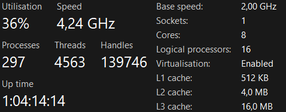

  - **Memoria RAM:** Tiene **16 GB** de RAM instalada (2 slots de 8 GB cada uno a 3200 MT/s), con **11.7 GB** en uso en el momento de la captura.
    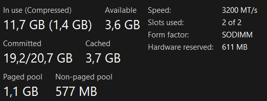

  - **Sistema Operativo:** La Imagen 1 muestra que estás utilizando **Windows 11 Home**, **versión 24H2**.
    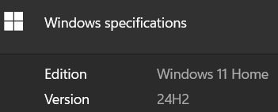

  - **Versión de VirtualBox:** La Imagen 2 indica que estás utilizando **VirtualBox Versión 7.1.8 r168469**.
    

  - **Versión de Docker:** La Imagen 3 muestra que la versión de Docker instalada es **Docker version 28.1.1, build 4eba377**.
    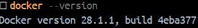

---

- **Máquina Virtual (VirtualBox):**

  - **Sistema Operativo Huésped:** Los comandos como `top` y otros comandos previos indican que el sistema operativo huésped es una distribución de Linux con entorno de escritorio GNOME (sugerido por `gnome-shell`). Asumiremos **Ubuntu** para este documento.
    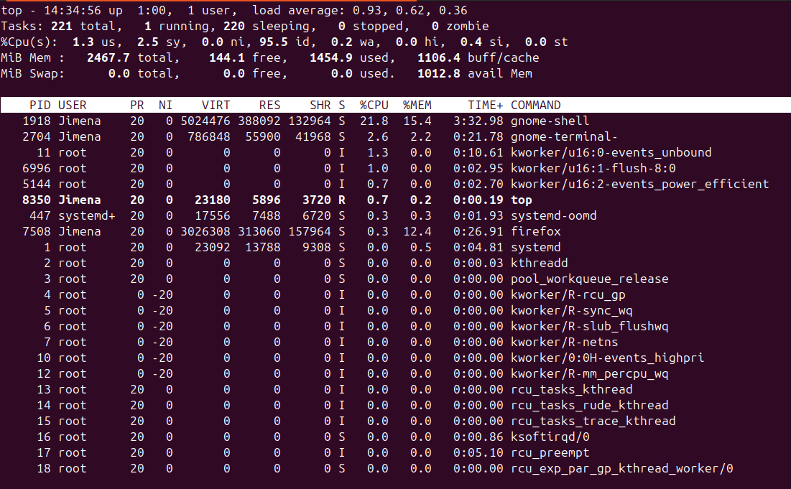

  - **CPU Virtual:** Tienes asignados **4 núcleos** de CPU virtual.
  - **Memoria RAM:** Tienes asignados **2560 MB** (2.5 GB) de RAM.
  - **Espacio en Disco Virtual:** El tamaño virtual del disco duro asignado a la VM es de **12 GB**.
  - **Configuración de Red:** La red de la VM está configurada en **NAT**.

---

* **Contenedor Docker:**

  - **Imagen Base:** La imagen `themoviedb:latest` (tamaño **74.3MB**) se construyó a partir de un `Dockerfile` que primero utiliza `node:18` para construir la aplicación y luego `nginx:alpine` para servirla. Esto indica que la API MovieDB es probablemente una aplicación web o API Node.js servida con Nginx.
    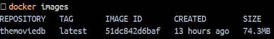
    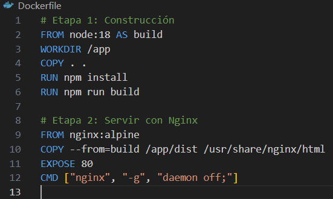

  - **Recursos Asignados al Contenedor (si se limitaron):** Se indica un límite de memoria de **7.463GiB**, aunque el uso actual es muy bajo (**14.8MiB**). No se muestra un límite de CPU explícito.
    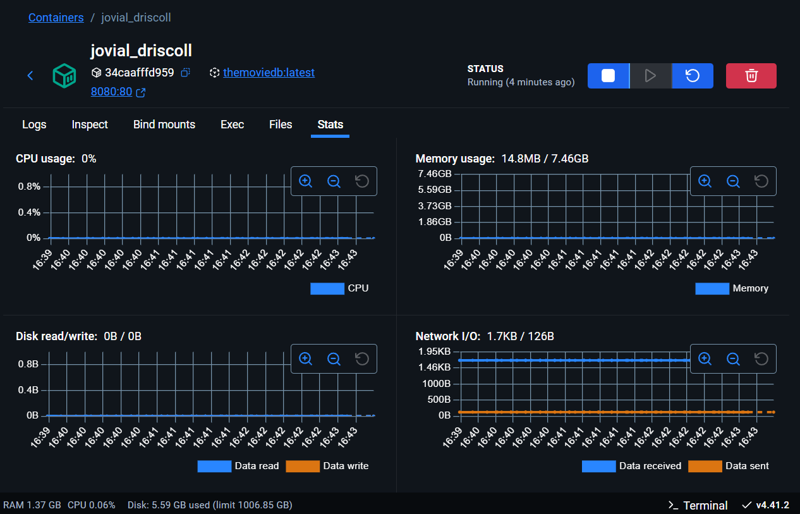

  - **Configuración de Red:** El puerto `80` del contenedor (Nginx) está mapeado al puerto `8080` del host, permitiendo el acceso a la API a través de `http://localhost:8080/`.
    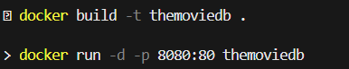

---

## Metodología Detallada y Herramientas Utilizadas

Para llevar a cabo una comparación, es fundamental definir cómo se midieron las diferentes métricas y las herramientas empleadas:

1.  **Uso de Recursos:**
    * **Uso de la CPU y memoria:**
      * **VM:** Se utilizó `top` para monitorizar el uso de CPU y memoria de la VM y del proceso de la API MovieDB.
        

      * **Docker:** Se utilizó `docker stats` para monitorizar el uso de CPU y memoria del contenedor `themoviedb`.
        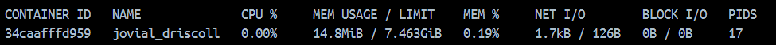

    * **Espacio en Disco Requerido:**
      * **VM:** Se utilizaron `du -sh` para el espacio de la API y `df -h` para el uso general del disco.
        
        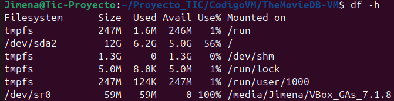

      * **Docker:** Se utilizaron `docker system df` y `docker images` para el espacio de la imagen y el contenedor.
        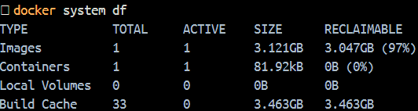
        

------

2.  **Tiempo de Arranque / Tiempo de Inicio:**

    - **VM:** Se utilizó `systemd-analyze` para medir el tiempo de arranque del sistema operativo huésped de la VM, registrando un tiempo total de **29.288 segundos**.
      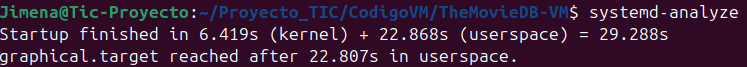

    * **Docker:** Se midió el tiempo desde el comando `docker run` hasta que la API estuvo accesible en `http://localhost:8080/`.

----

3.  **Caso de Prueba de Aplicación (API MovieDB):**

    - **Tiempo de Implementación:** La implementación en la VM implica la instalación de Ubuntu, Node.js, npm y la configuración de Nginx, lo que lleva **varias horas**. En Docker, la construcción de la imagen (`docker build`) y la ejecución del contenedor (`docker run`) toman **varios segundos/minutos** (dependiendo de la complejidad de la construcción y el tamaño de la imagen).
    - **Rendimiento (solicitudes/s):** (Los resultados de las pruebas de carga deben ir aquí).
    - **Latencia (tiempo de respuesta):** (Los resultados de las pruebas de carga deben ir aquí).
    - **Consumo de Recursos bajo carga:** (Los resultados de las pruebas de carga deben ir aquí).

4.  **Análisis de Aislamiento y Seguridad:**

    - Las VMs ofrecen un aislamiento robusto a nivel de hardware, ya que cada VM tiene su propio kernel. En contraste, los contenedores Docker comparten el kernel del host, lo que puede presentar riesgos de seguridad si no se configuran correctamente. Docker proporciona mecanismos de aislamiento a nivel de proceso utilizando namespaces y cgroups, y se pueden aplicar políticas de seguridad adicionales como seccomp y AppArmor. Sin embargo, una vulnerabilidad en el kernel del host podría potencialmente afectar a todos los contenedores.

5.  **Análisis de Portabilidad y Flexibilidad:**
    - La distribución de la API MovieDB como una imagen de Docker (74.3MB) es significativamente más portable y rápida que exportar una VM completa (varios GBs). Las imágenes de Docker pueden ejecutarse en cualquier sistema que tenga Docker instalado, independientemente del sistema operativo base (si la aplicación dentro es compatible). Docker también se integra mejor con flujos de trabajo de CI/CD, facilitando la creación, el envío y la ejecución de nuevas versiones de la aplicación.

## Resultados Detallados

En esta sección, se presentarán los resultados concretos obtenidos para cada métrica, utilizando tablas y gráficos cuando sea apropiado para facilitar la comparación.

| Métrica                 | Máquina Virtual (VM)                | Contenedor Docker (`themoviedb`) |
| ----------------------- | ----------------------------------- | --------------------------------- |
| CPU (Inactivo)          | (Valor %)                           | 0.00%                             |
| RAM (Inactivo)          | 1.4GiB                              | 14.8MiB                           |
| Espacio en Disco (API)  | 325MB                               | 74.4MB                           |

| Entorno                   | Tiempo (segundos) |
| ------------------------- | ----------------- |
| Arranque de la VM         | 29.288            |
| Inicio del Contenedor (`themoviedb`) | 2           |

---

### Análisis de Portabilidad y Flexibilidad

El empaquetamiento como imagen de Docker facilita la portabilidad y la distribución en comparación con la maquina virtual. La imagen de Docker (`themoviedb:latest`) es mucho más pequeña que una imagen de una maquina virtual completa, lo que agiliza las transferencias y el despliegue en diferentes entornos con Docker instalado. La naturaleza basada en capas de Docker también optimiza el uso del almacenamiento y las actualizaciones. La integración con registros de contenedores como Docker Hub simplifica la distribución y el versionado de la aplicación.

## Conclusión

Luego de toda esta investigacion y comparacion podemos ver que Docker demostró ser mucho más eficiente en el uso de recursos, ya que tiene  un menor consumo de RAM y espacio en disco para la API, ademas ofreció tiempos de inicio mucho más rápidos en comparación con la maquina virtual. La implementación con Docker es una opcion más ligera y ágil para desplegar la API MovieDB, priorizando la eficiencia y la velocidad de despliegue. La elección final dependerá de los requisitos específicos del proyecto, especialmente en cuanto a las necesidades de aislamiento y rendimiento bajo carga.